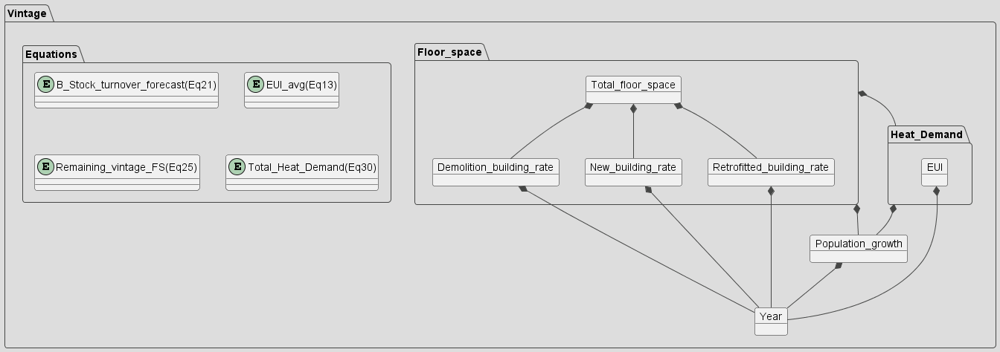
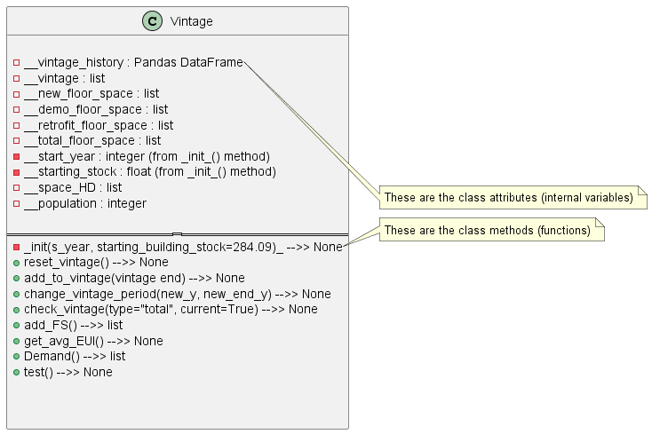

# Project Information

## Objectives
* Build a web application to:
  * Determine future floor space composition of British Columbia,
integrating demolition, new constructions, and refurbished
buildings.
  * Represent different building code strategies through their energy
use intensity values (for retrofit and newly constructed buildings)
  * Visualize the building stock composition of British Columbia for
certain years of a timeline in terms of retrofitted, and newly
constructed floor space.
  * Visualize the floor space energy use intensity and heating demand
per vintage (time period)
* Implement researched equations to represent building stock floor space.
* Perform thorough literature review on available academic peer-reviewed
publications to inform the decision making for the project.

To aid IESVic with their energy use predictive models, a webtool was created to incorporate building stock and energy demand algorithms for user-friendly operation of the model.
Analyzing residential energy demands involves analysis over vintage. A vintage is a collection of buildings created in a certain period. As time continues, the proportion of floor space and therefore energy demand of a particular vintage changes as buildings are demolished and renovated, and new constructions are added within the current year’s  intage. This capstone project could have far-reaching social impacts by promoting sustainable urban development, educating the public about energy efficiency, and aiding economic planning for energy use.

This website was created using a Python package called Jupyter Books. The source and static content are hosted on Github Pages, and automation through Github Actions provides continuous deployment of the webpage.

Python class diagrams:

## References

[1]
“Institute for Integrated Energy Systems,” University of Victoria, [Online].
Available: https://www.uvic.ca/research/centres/iesvic/index.php

[2]
H. Farzaneh, “The Systems Approach and Energy Models,” in Energy Systems
Modeling, Singapore: Springer Singapore Pte. Limited, 2019, pp. 1–15.
doi:10.1007/978-981-13-6221-7_1.

[3]
EGBC, “EGBC code of Ethics.” Engineers & Geoscientists British Columbia,
[Online]. Available:
https://www.egbc.ca/Complaints-Discipline/Code-of-Ethics/Code-of-Ethics

[4]
S. Eggimann, J. W. Hall, and N. Eyre, “A high-resolution spatio-temporal energy
demand simulation to explore the potential of heating demand side management
with large-scale heat pump diffusion,” Applied energy, vol. 236, pp. 997–1010,
2019, doi: 10.1016/j.apenergy.2018.12.052.

[5]
S. Eggimann, N. Vulic, M. Rüdisüli, R. Mutschler, K. Orehounig, and M. Sulzer,
“Spatiotemporal upscaling errors of building stock clustering for energy demand
simulation,” Energy and buildings, vol. 258, p. 111844–, 2022, doi:
10.1016/j.enbuild.2022.111844.

[6]
Z. Wang, Y. Zhu, F. Wang, P. Wang, C. Shen, and J. Liu, “Prediction of Building
Stock Energy Demand,” in Proceedings of the 11th International Symposium on
Heating, Ventilation and Air Conditioning (ISHVAC 2019), Singapore: Springer
Singapore Pte. Limited, 2020, pp. 1305–1314. doi:
10.1007/978-981-13-9528-4_132.

[7]
E. McKenna, M. Krawczynski, and M. Thomson, “Four-state domestic building
occupancy model for energy demand simulations,” Energy and buildings, vol. 96,
pp. 30–39, 2015, doi: 10.1016/j.enbuild.2015.03.013.