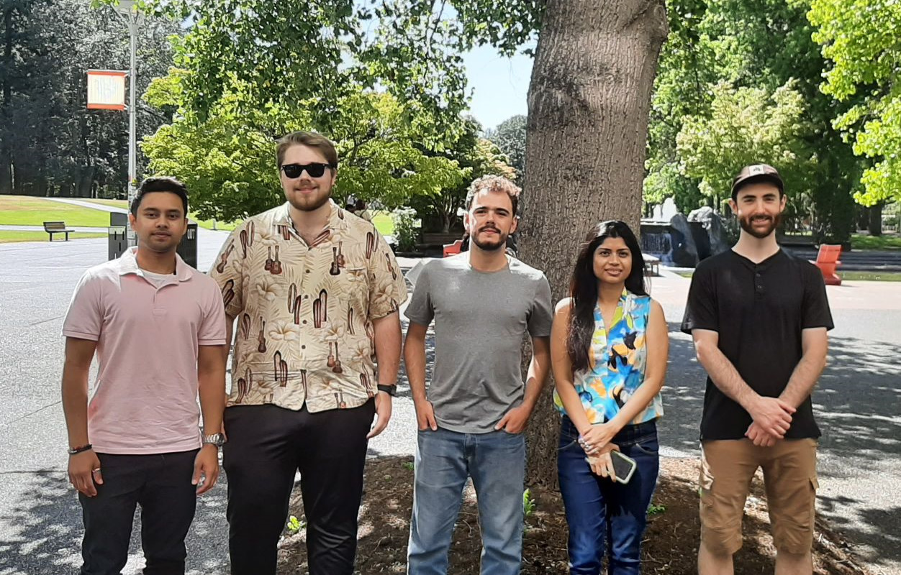

# Team Information



```{list-table}
:header-rows: 1

* - Alex Spacek
  - Cristiano Fernandes
  - Jacob Kloepper
  - Medha Guha 
  - Minarul Shawon
* - Web
  - Coordinator
  - Visualization
  - Code
  - Code
```

We are a team of Electrical and Computer Engineering undergrads at UVic. We chose to develop this application because it suited our common interest in software development and paired well with an interesting and booming field of study, which we believe can help us achieve a better understanding of web development, engineering, the energy industry, and it gives us a chance to exercise our individual and collective strengths and skills. As an engineering project, our work here respects the EGBC code of ethics. As part of a growing field of research, our hope is that this web application will prove capable of producing the results that are currently produced by IESVic and similar initiatives across the country in a more time-efficient and reliable way. This product will hopefully be useful for all energy researchers in the region and can benefit greatly from a larger community of researchers and software developers alike.

 